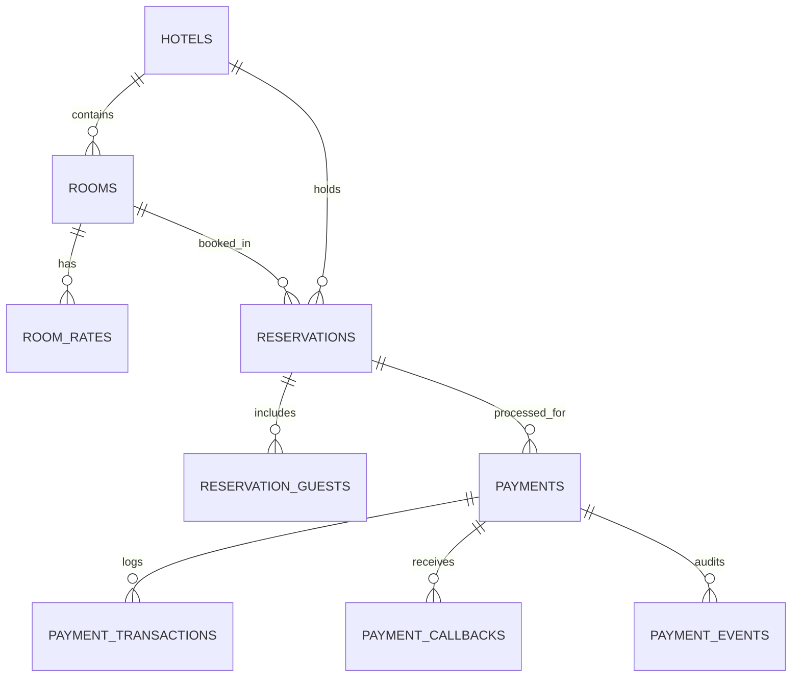

# NOURLA BOUTIQUE HOTEL - VERİTABANI VE SCHEMAS DOKÜMANI

## 1. Veritabanı Mimarisi

Sistem, taşınabilir ve sıfır-konfigürasyon ile çalışabilen **SQLite** veritabanı altyapısına sahiptir (`better-sqlite3` / `sqlite3`). PostgreSQL ve MySQL uyumlu SQL DDL scriptleri sunulmaktadır.

Veritabanı migration ve şema dosyalarının konumları:
* Master Schema File: `/database/schema.sql`
* Migration Engine: `/database/migrations/001_initial_schema.sql`

---

## 2. Tablo Tanımları ve İlişkileri

### Tablo Listesi:
1. `HOTELS`: Otel kimlik ve varsayılan para birimi tanımları.
2. `ROOMS`: Otel oda kategorileri, m² ve kapasite bilgileri.
3. `ROOM_RATES`: Fiyat ve pansiyon tipleri (`RO`, `BB`, `FB`, `AI`).
4. `AVAILABILITY_CACHE`: ElektraWeb PMS müsaitlik ve fiyat önbelleği.
5. `RESERVATIONS`: Değişmez (Immutable) Rezervasyon Snapshot kayıtları ve durum takibi.
6. `RESERVATION_GUESTS`: Konaklayacak misafirlerin kimlik ve iletişim bilgileri.
7. `PAYMENTS`: Ödeme işlem kayıtları (Provider, Tutar, Güvenli Maskelenmiş Kart Bilgisi).
8. `PAYMENT_TRANSACTIONS`: Detaylı finansal işlem ve 3D Secure hareket günlüğü.
9. `PAYMENT_EVENTS`: Güvenlik ve denetim (Audit) olay günlüğü.
10. `PAYMENT_CALLBACKS`: Banka/Sanal POS callback webhooks logları.
11. `CANCELLATION_POLICIES`: İptal ve iade politikaları.
12. `IDEMPOTENCY_KEYS`: Replay koruması için idempotency hash veritabanı.

---

## 3. SQL Çalıştırma ve Migration

Sunucu ilk başlatıldığında (`node index.js`), `server/database/db.js` modülü otomatik olarak `/database/migrations/001_initial_schema.sql` scriptini çalıştırır ve eksik tabloları ile indeksleri oluşturur.
